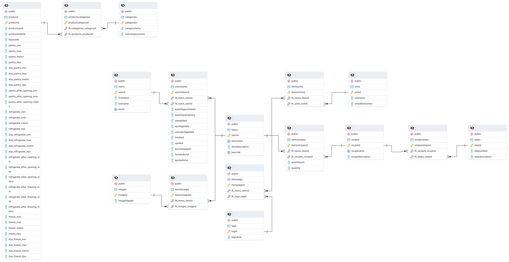
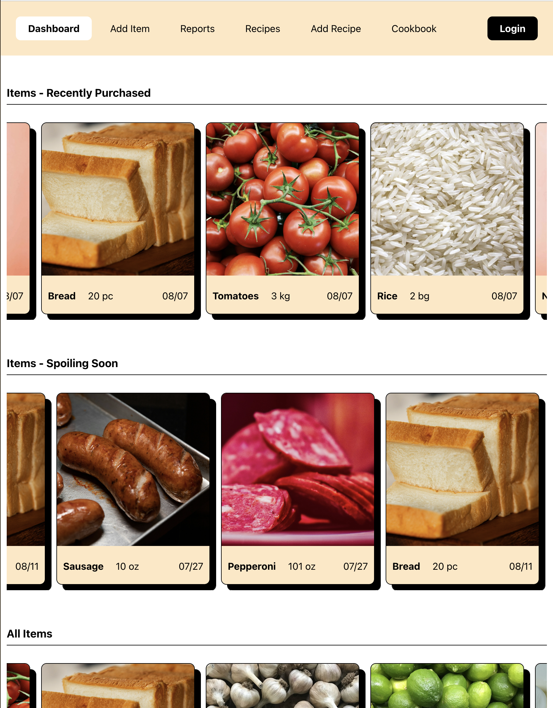
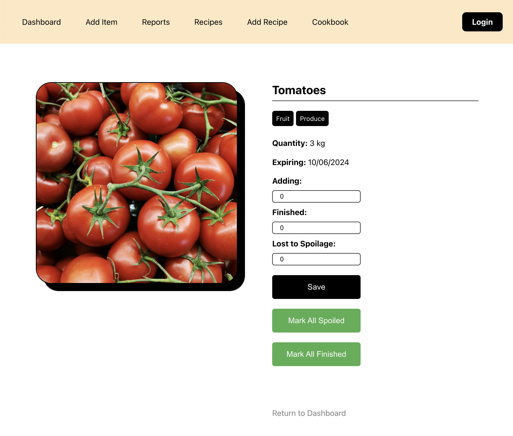

# Smart Grocery Housekeeping

## Contributors

Erik Lynch, Jillian Vondy, Rachel Covington, Kevin Klein

## Overview
Capstone Project - Summer 2024 - Oregon State University

### This web application provides the following:
- **User generated grocery records**
  - Image recognition to automatically identify fruits and vegtables
  - Barcode scanning for packaged items
  - Manual input and verification of information
  - Food spoilage estimates based on USDA data
- **A dashboard of all grocery items**
  - Identifies items spoiling soon
  - Identifies items recently purchased
  - Displays all items
- **The ability for the user to perform "housekeeping" on the grocery data**
  - Mark an item as spoiled
  - Mark an item as finished
  - Update the quantity of an item remaining
- **Reports about the grocery item data**
  - Frequently used items
  - Frequently unused items
  - Frequently spoiled items
- **Recipes based on groceries**
  - Recipes using items spoiling soon
  - Recipes with minimal additional ingredients
  - A "cookbook" where users can input their own recipes

## Implementation Details
- [Figma](https://www.figma.com/proto/EccuouzOB2mMfGrjTj08SP/Smart-Grocery-Housekeeping?node-id=0-1&t=nbDnhliuOygyemjY-1) - initial UI design
- [React](https://react.dev/) - UI
- [react-multi-carousel](https://www.npmjs.com/package/react-multi-carousel) - item and recipe carousels
- [Google Cloud Vision](https://cloud.google.com/vision?hl=en) - fruit and produce recognition
- [Spoonacular API](https://spoonacular.com/food-api) - recipe suggestions
- [Scandit](https://www.scandit.com/?utm_source=google&utm_medium=cpc&utm_campaign=North-America-24Q3-ams-brand-paid-search-Brand-Terms-Mix&utm_term=scandit&gad_source=1&gclid=CjwKCAjw_Na1BhAlEiwAM-dm7FCNa_kPXgEifCkxgkmOX9rDwRQWqdHHhBQnw_xyxzg5ts_AZsSIaRoCN3UQAvD_BwE) - barcode scanning
- [FSIS - FoodKeeper Data](https://catalog.data.gov/dataset/fsis-foodkeeper-data) - spoilage guidelines
- [AWS PostgreSQL](https://aws.amazon.com/rds/postgresql/) - Database

## Database - ER Diagram

## Example Pages

The user dashboard page that displays carousels of items recently purchased, spoiling soon, and all items.

&nbsp;

The edit item page that allows users to perform "housekeeping" on grocery items.

&nbsp;

